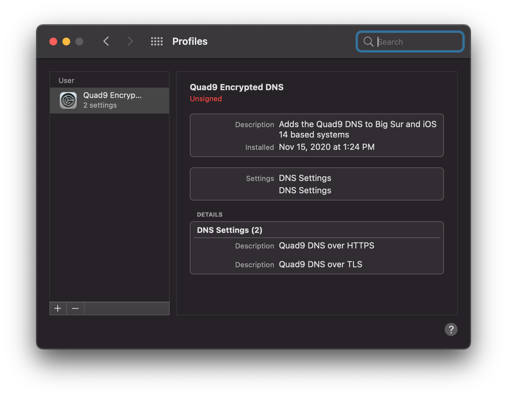
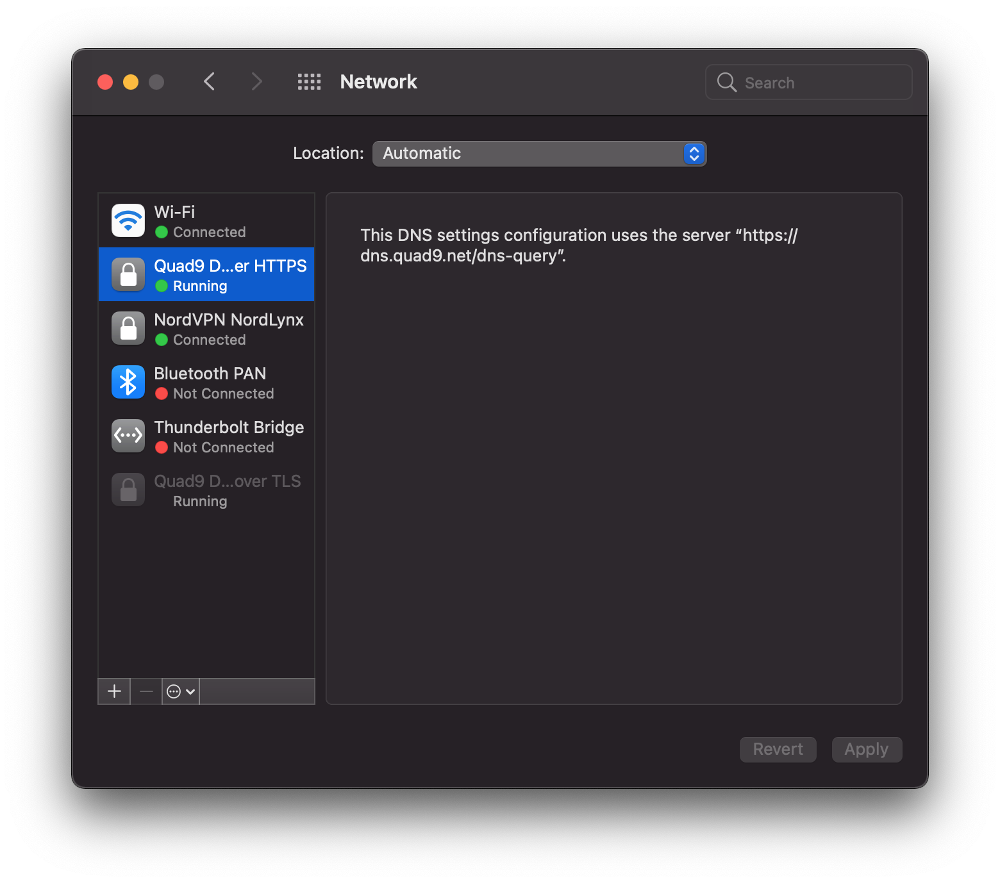
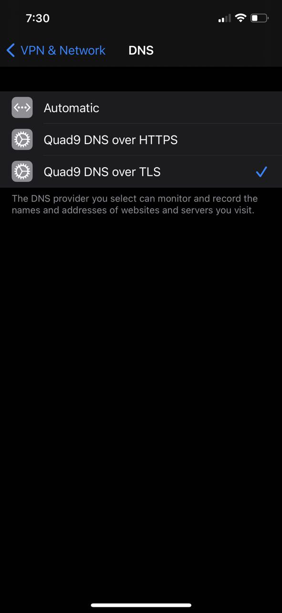

# encrypted-dns
DNS over TLS and HTTPS settings to protect your privacy.

Example DNS Server is provided by [Quad9](https://www.quad9.net/doh-quad9-dns-servers/).

## Apple
Mac OS Big Sur and iOS 14 support DNS over HTTPS and TLS.

### Mac OS

### iOS

